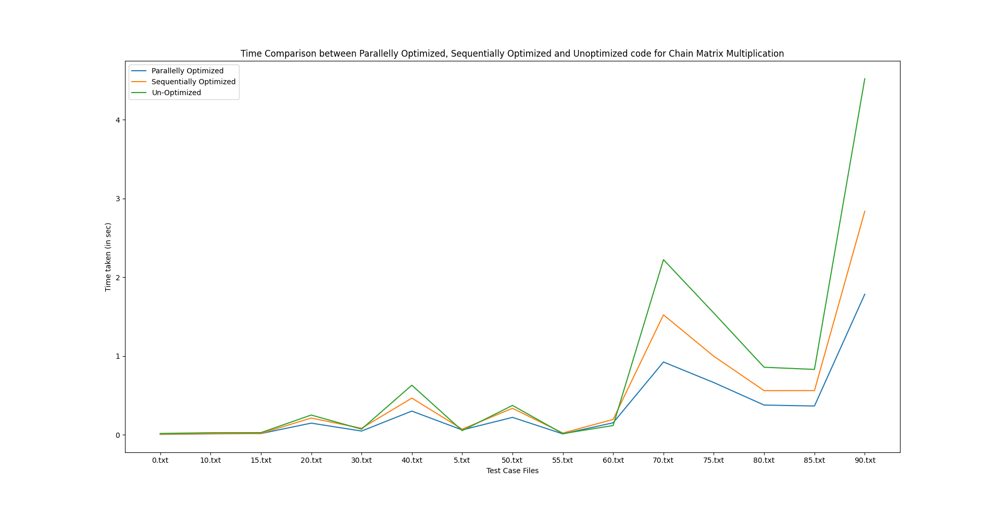

# SPP Assignment 2

- Author: Rutvij Menavlikar (**2019111032**)

---

## Chain Matrix Multiplication

### Naive Approach

- The most common approach is to take input of matrices sequentially and multiply the next matrix with the product of the previous matrices.
- And while multiplying matrices of dimensions *n*&times;*m* and *m*&times;*k*, loop over *n*, *k* and *m* and add product of values, that is loop over every cell of the new matrix and calculate it's value.

### Sequantial Optimization

- I first take input of all matrices.
- Then, by using the dimensions of the matrix, I find the order to multiply the matrices which minimises the number of operations performed, and multiply them using a recursive function.
- While mutiplying two matrices, I use the tiled matrix multiplication algorithm with tile size of *64*&times;*64*
    - In this algorithm, for a tile size *s*, we usually access the matrices in step-by-step. And in each step we only consider rows of size less than or equal to s elements.
- I also flipped orders of loop such that, while multiplying matrices of dimensions *n*&times;*m* and *m*&times;*k*, loop over *n*, *m* and *k* in this order so as to obtain continuous blocks of memory and avoid cache misses.
- Another optimization I performed was to unroll the innermost loop of matrix multiplication. That is, in one iteration of the innermost loop I perform 16 operations and in the loop make jumps of 16 positions.
- Some more general optimizations are:
    - Using `register int` for counters of loops.
    - Dynamic allocation of memory to store matrices and arrays.
    - Avoiding dereferencing pointers inside loops as much as possible.
    - Avoiding calculations inside loops as much as possible.
    - Using pre-increments in `for` loops instead of post-increments.
    - Using `restrict` keyword while passing pointers to functions.

### Parallel Optimization

- I first take input of all matrices.
- Then, by using the dimensions of the matrix, I find the order to multiply the matrices which minimises the number of operations performed, and multiply them using a recursive function.
- While multiplying the two matrices, let their dimensions be *n*&times;*m* and *m*&times;*k*.
    - First I take the transpose of the second matrix, and hence it's dimensions are *k*&times;*m*.
    - Then, I loop over *n*, *k* and *m* in this order and update the resulting matrix.
    - In this order of loops, I parallelise the outermost loop, i.e. the loop over *n*.
    - This order of loops cannot be changed as shared memory of threads cause the update of resulting array in the wrong position.
    - To keep this order of loops and optimize multiplication, taking transpose of second matrix is necessary.
- Loop unrolling, usage of `restrict` keyword, usage of `register int`, avoiding dereferencing pointers inside loops and using pre-increments in `for` loops is not necessary due to the **O2** flag of compiler optimization.
- I have used these optimizations in some places as I have extended my previous assignment code.

### Comparison of Parallely Optimized code to Sequentially Optimized code to Unoptimized code

